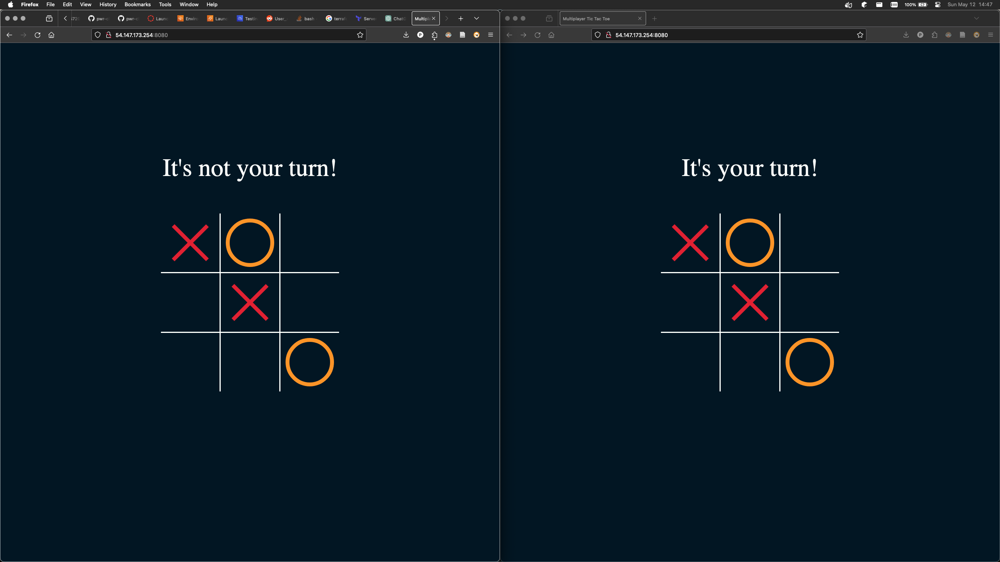

# Adam Pawłowski - Terraform, EC2, TicTacToe report

- Course: *Cloud programming*
- Group: *poniedziałek 9:15*
- Date: 04 maj 2024

## Environment architecture

Projekt polegał na konfiguracji infrastruktury w chmurze AWS za pomocą narzędzia Terraform. Stworzona infrastruktura obejmuje Virtual Private Cloud (VPC) z dwiema podsieciami (publiczną i prywatną), instancję EC2 z publicznym adresem IP oraz grupę zabezpieczeń pozwalającą na dostęp z internetu do określonych portów.

1. **VPC (Virtual Private Cloud):**
   - Utworzono VPC o nazwie "my_vpc" z adresem CIDR "10.0.0.0/16".
   - Dodano dwie podsieci: publiczną (CIDR: "10.0.101.0/24") i prywatną (CIDR: "10.0.102.0/24").
   - Włączono obsługę DNS oraz przydzielanie nazw hostów.

2. **Instancja EC2:**
   - Utworzono instancję EC2 z systemem Ubuntu i typem instancji "t2.micro".
   - Przypisano publiczny adres IP oraz umieszczono instancję w podsieci publicznej.
   - Zainstalowano niezbędne narzędzia, w tym Docker, Docker Compose oraz git.
   - Pobrano i uruchomiono aplikację "Gra w kółko i krzyżyk" z repozytorium GitHub.

3. **Grupa zabezpieczeń:**
   - Stworzono grupę zabezpieczeń o nazwie "ttc_security", która kontroluje ruch sieciowy do instancji EC2.
   - Zdefiniowano reguły przychodzące umożliwiające dostęp z internetu do portów SSH, HTTP (frontend) oraz HTTP (port 8080).

## Preview

Aplikacja "Gra w kółko i krzyżyk" została uruchomiona na instancji EC2 i działa poprawnie. Połączenie z aplikacją można nawiązać poprzez przeglądarkę internetową, wpisując publiczny adres IP instancji i port 8080.

## Reflections

1. What did you learn?
- Projekt umożliwił mi/zapoznał mnie z konfiguracją infrastruktury AWS za pomocą narzędzia Terraform.
- Poznałem/am sposób tworzenia i zarządzania siecią VPC, instancjami EC2 oraz grupami zabezpieczeń.
2. What obstacles did you overcome?
- Podczas konfiguracji infrastruktury napotkałem/am pewne trudności związane z ustawieniem reguł grupy zabezpieczeń.
- Nadal nierozwiązanym problemem jest uzywanie `user_data` do automatycznego uruchamiania aplikacji po utworzeniu instancji EC2. Niestety nie udało mi się tego uruchomić. Uzyłem więc zamiast tego `remote-exec`.
3. What did you help most in overcoming obstacles?
- W trakcie realizacji projektu skorzystałem/am z dokumentacji AWS oraz Terraform, a także z forów internetowych, gdzie znalazłem/am odpowiedzi na napotkane problemy.
4. Was that something that surprised you?
- Byłem/am zaskoczony/a elastycznością i skalowalnością chmurze AWS oraz prostotą zarządzania infrastrukturą przy użyciu Terraform.

Projekt pozwolił mi/zapoznał mnie z praktycznymi aspektami konfiguracji infrastruktury w chmurze obliczeniowej. Pozyskane doświadczenie będzie przydatne w dalszym rozwoju moich umiejętności w dziedzinie chmury obliczeniowej i DevOps.
